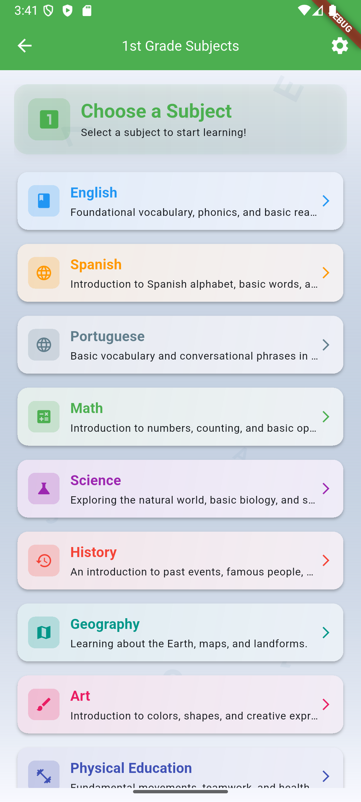
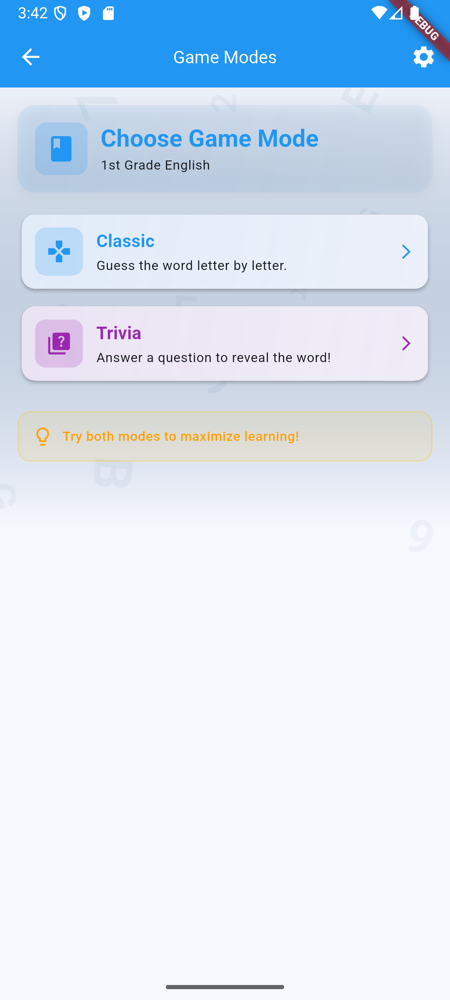
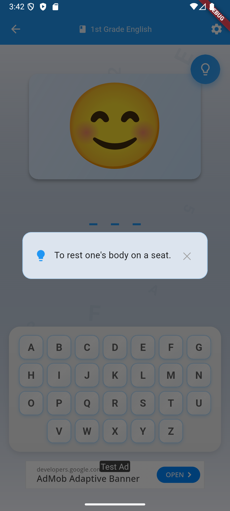
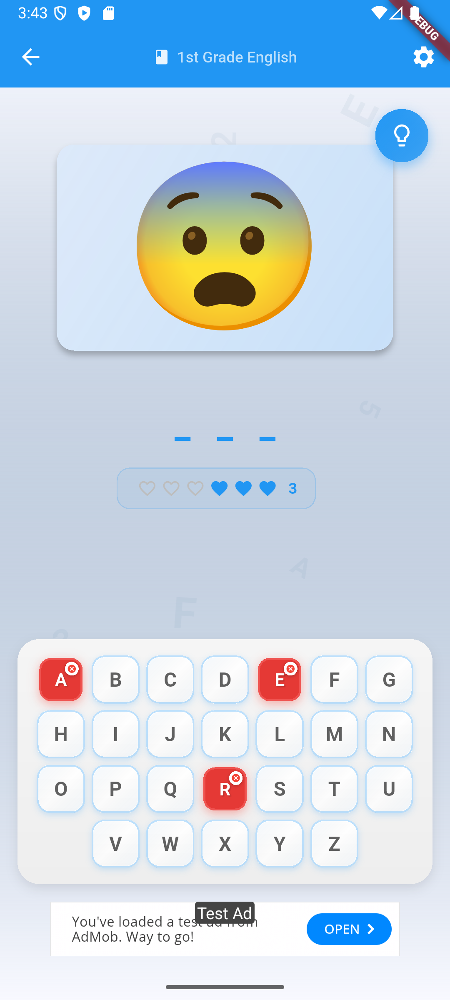
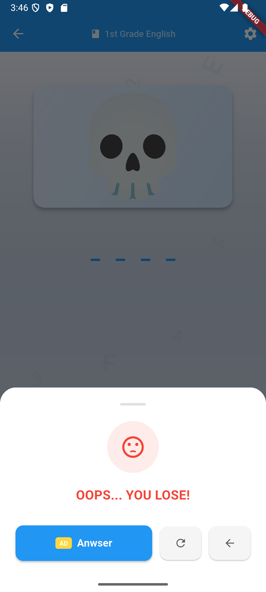

# 2025

### First Third: January, February, March, April

**Focus:** Microfrontends with React

**Key Topics/Languages:**  
	React: Component-based architecture, state management, hooks  
	RSBuild: Building and deploying microfrontends  
	PrimeReact: UI component library  
	PrimeFlex: CSS utility library  

**Some Goals:**  
	Implement a basic microfrontend application using React and RSBuild.  
	Create a reusable microfrontend template for business products.  
	Set up communication between microfrontends.  
	Improve the use PrimeReact and PrimeFlex for consistent UI design.  
	Develop a NestJS backend to support the microfrontend architecture.  

**Result:**  

[PTCGO](https://github.com/allanfoppa/ptcgo)

### Second Third: May, June, July, August

**Focus:** Refactoring and Design Principles

**Key Topics/Languages:**  
	Refactoring techniques (e.g., Martin Fowler's refactorings)  
	Design patterns (e.g., Gang of Four)  
	SOLID principles  

**Some Goals:**  
	Apply refactoring techniques to improve existing codebases.  
	Learn and implement common design patterns.  
	Understand and apply SOLID principles for maintainable and scalable code.  

**Result:**  

[Refactoring and Design Principles](https://github.com/allanfoppa/refactoring-and-design-principles)

### Third Third: September, October, November, December

**Focus:** Mobile with Flutter

**Key Topics/Languages:**  
	Dart: The programming language for Flutter  
	Flutter SDK: Widgets, layout, state management  
	State Management: Provider, Bloc, or Riverpod  
	API Integration: Handling network requests (e.g., using http package)  
	Mobile UI/UX: Adaptive design for different screen sizes

**Some Goals:**  
	Build a complete, multi-screen mobile application using Flutter.

**Result:**  

Screenshots             |  Screenshots
:-------------------------:|:-------------------------:
  |  
 | 
 | 

